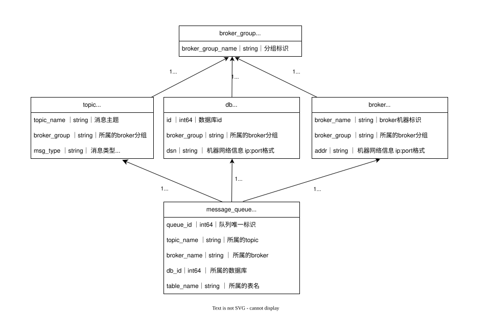
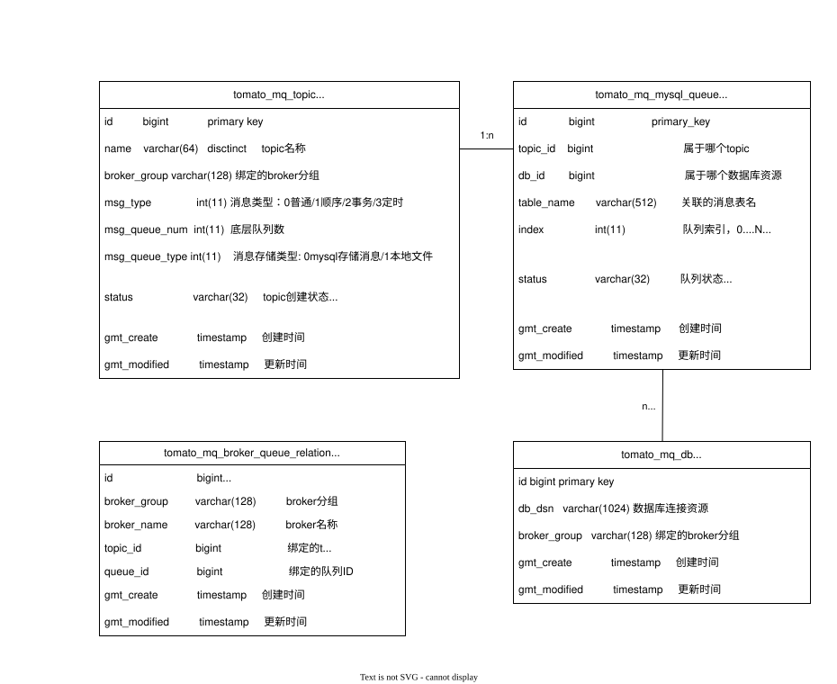
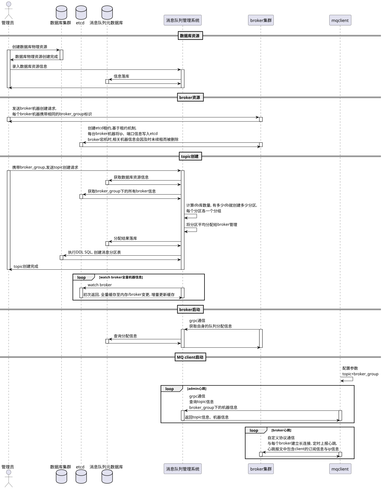

<!--
 * @Author: Tomato
 * @Date: 2026-05-16 18:49:37
-->

# 项目简介

fixme TOMATO todo

# 管理时设计

## 架构设计

## 领域模型



- **broker_group**: 消息队列集群逻辑分组, topic的每个队列会给相同分组的broker管理，队列数据会存储在相同分组的db中
- **broker**: 消息队列服务端, 负责处理消息收发网络请求
- **topic**: 消息的逻辑分组, 存放同种类型的消息
- **message_queue**: 消息队列, 消息存储、顺序消息的原子单位, 一个topic可以有多个消息队列, 一个broker可以管理多个消息队列, 每个消息队列底层是db中的一张表
- **db**: 消息存储端, tomato底层使用数据库存储消息

## 数据模型



- **tomato_mq_db**: 数据库资源信息, 存储DB连接字符串、绑定的group分组等信息
- **tomato_mq_topic**: 消息队列topic信息
- **tomato_mq_mysql_queue**: topic底层队列的具体信息(消息存在哪个DB的哪个表、队列逻辑编号等)
- **tomato_mq_broker_queue_relation**: 记录每个broker管理了哪些队列

## 集群管理整体流程



数据库创建阶段:

- 管理员在数据库集群创建数据库资源, 这些资源会用于存储消息
- 在消息队列关系系统中录入数据库资源信息, 并为每个数据库打上broker_group标识, 每个数据库唯一归属于一个broker_group

broker创建阶段:

- 在broker集群创建broker实例
- broker注册至etcd, broker注册逻辑
  - 使用etcd作为注册中心、存储broker的ip、端口等机器信息
  - 每个broker启动时, 将自己的机器信息写入ectd, 并创建一个etcd租约, 将etcd租约与写入的ip信息绑定
  - ectd写入格式:  
    key:/broker/{broker分组}/{broker名称}  
    value: ip:port

创建topic:

- 获取broker_group的DB资源数, topic队列数=DB资源数
- 从etcd中获取到broker_group中活跃的broker信息, 将队列平均分配给每个broker
- 分配信息保存在DB中

broker与client:

- broker启动时, 与消息队列管理系统通信, 获取队列分配信息
- client启动后, 与消息队列管理系统定时通信, 获取topic信息与broker信息; 与broker定时通信, 上报存活状态

# 通信层设计

## TCP层

核心领域模型

Session: 代表一个客户端连接。
Server: 代表broker服务端

## 协议层

# admin-HTTP-API

## POST /v1/mqadmin/database/register

- 作用: 注册数据库资源
- 请求头:
- 请求体:
  ```json
  {
    // 数据库资源所属的集群分组
    "brokerGroup": "test",
    // 数据库名称
    "name": "tomato_mq_msg_0",
    // 数据库账号
    "user": "root",
    // 数据库密码
    "password": "root",
    // 数据库域名
    "host": "127.0.0.1",
    // 数据库端口
    "port": 3306
  }
  ```
- 响应体:
  - 请求成功:

    ```json
    {
      "success": true,
      "data": {
        // 主键
        "id": 8,
        // 唯一ID
        "guid": "test:tomato_mq_msg_0",

        // 连接字符串
        "dsn": "root:root@tcp(127.0.0.1:3306)/tomato_mq_msg_0?charset=utf8mb4\u0026parseTime=True\u0026loc=Local",
        "brokerGruop": "test",
        "createdAt": "2026-05-28T23:36:34+08:00",
        "updatedAt": "2026-05-28T23:36:34+08:00"
      }
    }
    ```

  - 请求失败:

    ```json
    {
      "success": false,
      "error": {
        "code": 20002,
        "message": "db insert failed"
      }
    }
    ```

- curl样例:

  ```bash
  curl --location --request POST 'http://localhost:8080/v1/mqadmin/database/register' \
  --header 'Content-Type: application/json' \
  --header 'Accept: */*' \
  --header 'Host: localhost:8080' \
  --header 'Connection: keep-alive' \
  --data-raw '{
    "brokerGroup": "test",
    "name": "tomato_mq_msg_0",
    "user": "root",
    "password": "root",
    "host": "127.0.0.1",
    "port": 3306
  }'
  ```

## GET /v1/mqadmin/database/query

- 作用: 查询broker_group下的所有数据库资源
- 请求头:
- 请求参数:
- 响应:
- curl样例:
  - 请求:

  ```bash
  curl -X GET http://localhost:8080/v1/mqadmin/database/query?group="test"

  ```

  - 响应

  ```json
  {
    "success": true,
    "data": [
      {
        "id": 10,
        "guid": "test:tomato_mq_msg_0",
        "dsn": "root:root@tcp(127.0.0.1:3306)/tomato_mq_msg_0?charset=utf8mb4\u0026parseTime=True\u0026loc=Local",
        "brokerGruop": "test",
        "createdAt": "2026-05-28T23:40:17+08:00",
        "updatedAt": "2026-05-28T23:40:17+08:00"
      },
      {
        "id": 12,
        "guid": "test:tomato_mq_msg_1",
        "dsn": "root:root@tcp(127.0.0.1:3306)/tomato_mq_msg_1?charset=utf8mb4\u0026parseTime=True\u0026loc=Local",
        "brokerGruop": "test",
        "createdAt": "2026-05-28T23:46:24+08:00",
        "updatedAt": "2026-05-28T23:46:24+08:00"
      }
    ]
  }
  ```

````

# 本地启动

1. 安装数据库

```bash
# 安装/启动etcd
NODE1=127.0.0.1
DATA_DIR=/root/download/etcddata
REGISTRY=quay.io/coreos/etcd
ETCD_VERSION=v3.6.11
IMAGE_NAME=my_etcd

setenforce 0

podman run -it -d -p 2379:2379 -p 2380:2380 \
  --user root \
  --volume=${DATA_DIR}:/etcd-data \
  --name ${IMAGE_NAME} ${REGISTRY}:${ETCD_VERSION} \
  /usr/local/bin/etcd \
  --data-dir=/etcd-data --name node1 \
  --initial-advertise-peer-urls http://${NODE1}:2380 --listen-peer-urls http://0.0.0.0:2380 \
  --advertise-client-urls http://${NODE1}:2379 --listen-client-urls http://0.0.0.0:2379 \
  --initial-cluster node1=http://${NODE1}:2380

podman exec ${IMAGE_NAME} etcdctl endpoint health

# 安装/启动mysql
db_root_dir=/root/download/mysqldata
mkdir -p $db_root_dir/master/conf
mkdir -p $db_root_dir/master/data

podman run --name mysql-master -p 3306:3306 -e MYSQL_ROOT_PASSWORD=root -e LANG=C.UTF-8\
-v $db_root_dir/master/conf:/etc/mysql/conf.d                   \
-v $db_root_dir/master/data:/var/lib/mysql                      \
-d mysql:8.4.7

podman exec -it mysql-master bash
````

2. 建库建表  
   [SQL明细](./docs/sql/localdb.sql)
